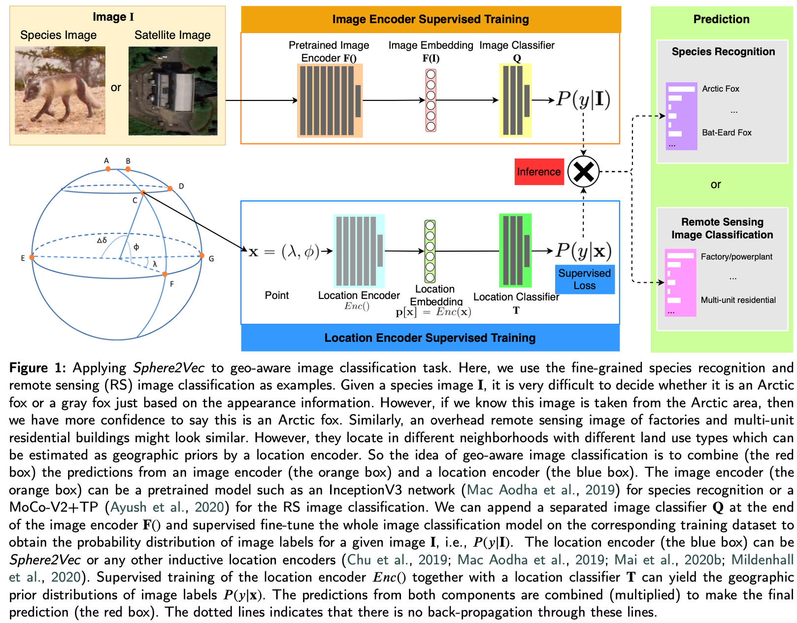
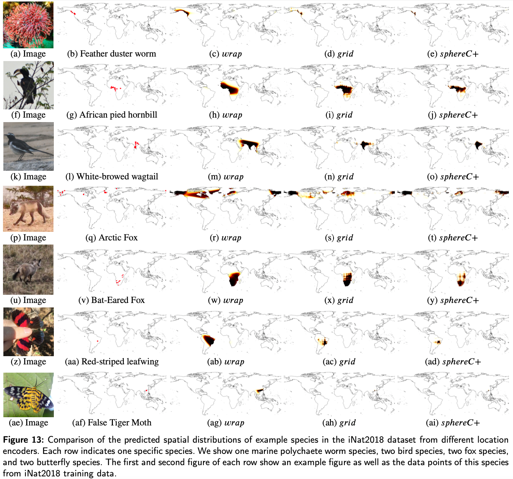
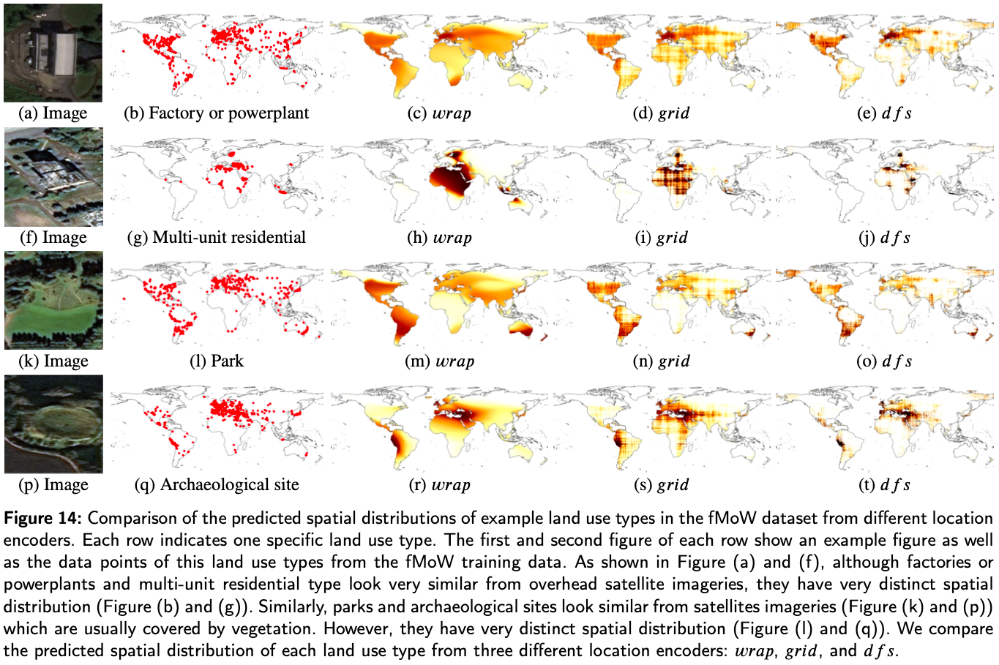

# Sphere2Vec: A General-Purpose Location Representation Learning over a Spherical Surface for Large-Scale Geospatial Predictions
Code for recreating the results in [our Sphere2Vec paper](H).

<!-- ## Related Link
1. [Arxiv Paper](https://arxiv.org/abs/2201.10489) -->


Please visit [my Homepage](http://www.geog.ucsb.edu/~gengchen_mai/) for more information.

## Model Architecture
<p align="center">
  
</p>


### Dependencies
- Python 3.7+
- Torch 1.7.1+
- Other required packages are summarized in `main/requirements.txt`.


### Train and Evaluation
The main code are located in `main` folder

1) `run_sphere2vec.sh` is used to train and evaluate any location encoder we describe in the paper.  


### Data
1. The species fine-grained recognition dataset can be downloaded from [this website](https://homepages.inf.ed.ac.uk/omacaod/projects/geopriors/index.html).
2. All training dataset should be downloaded to `./geo_prior_data/` folder.
3. Please structure all the dataset in a way shown in `./main/path.py`.


### Location Encoder Name
The codebase uses different location encoder model names from the name we use in the paper. Here, we list the correspondence between them.

| Paper Name          | Code Name          |
|---------------------|--------------------|
| xyz                 | xyz                |
| wrap                | geo_net            |
| wrap + ffn          | geo_net_fft        |
| rbf                 | rbf                |
| rff                 | rff                |
| Space2Vec-grid      | gridcell           |
| Space2Vec-theory    | theory             |
| NeRF                | nerf               |
| Sphere2Vec-sphereC  | sphere             |
| Sphere2Vec-sphereC+ | spheregrid         |
| Sphere2Vec-sphereM  | spheremixscale     |
| Sphere2Vec-sphereM+ | spheregridmixscale |
| Sphere2Vec-dfs      | dft                |


## Comparison of the predicted spatial distributions of example species in the iNat2018 dataset from different location encoders
<p align="center">
  
</p>

## Comparison of the predicted spatial distributions of example land use types in the fMoW dataset from different location encoders
<p align="center">
  
</p>


### Reference

If you use grid location encoder, please also cite [our ICLR 2020 paper](https://openreview.net/forum?id=rJljdh4KDH) and [our IJGIS 2022 paper](https://www.tandfonline.com/doi/full/10.1080/13658816.2021.2004602):
```
@inproceedings{mai2020space2vec,
  title={Multi-Scale Representation Learning for Spatial Feature Distributions using Grid Cells},
  author={Mai, Gengchen and Janowicz, Krzysztof and Yan, Bo and Zhu, Rui and Cai, Ling and Lao, Ni},
  booktitle={International Conference on Learning Representations},
  year={2020},
  organization={openreview}
}

@article{mai2022review,
  title={A review of location encoding for GeoAI: methods and applications},
  author={Mai, Gengchen and Janowicz, Krzysztof and Hu, Yingjie and Gao, Song and Yan, Bo and Zhu, Rui and Cai, Ling and Lao, Ni},
  journal={International Journal of Geographical Information Science},
  volume={36},
  number={4},
  pages={639--673},
  year={2022},
  publisher={Taylor \& Francis}
}
```
If you use the unsupervised learning function, please also cite [our ICML 2023 paper](https://gengchenmai.github.io/csp-website/). PLease refer to [our CSP webite](https://gengchenmai.github.io/csp-website/) for more detailed information.  
```
@inproceedings{mai2023csp,
  title={CSP: Self-Supervised Contrastive Spatial Pre-Training for Geospatial-Visual Representations},
  author={Mai, Gengchen and Lao, Ni and He, Yutong and Song, Jiaming and Ermon, Stefano},
  booktitle={International Conference on Machine Learning},
  year={2023},
  organization={PMLR}
}
```